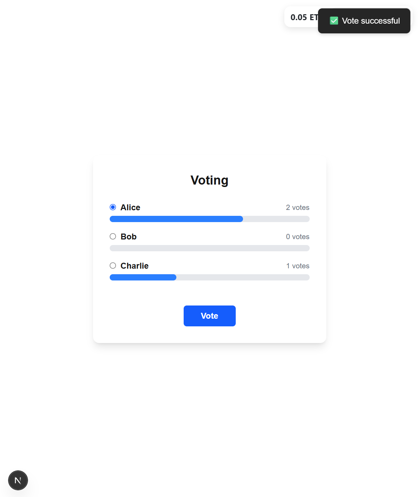

# 🗳 Voting DApp
This is a decentralized voting application built with Next.js, TypeScript, Wagmi, and RainbowKit, and deployed on the Sepolia Ethereum testnet. Users can connect their wallets, view available proposals, and cast their votes via a smart contract.

## 📸 Screenshots

## 🚀 Features
- Connect with wallets using RainbowKit
- Fetch and display proposals from the smart contract
- Vote on a selected proposal
- Live UI updates with transaction feedback
- Toast notifications for actions and errors
- Styled with Tailwind CSS

## 🛠 Tech Stack
- Frontend: Next.js, TypeScript, Tailwind CSS
- Web3: Wagmi, RainbowKit, Viem
- Smart Contract: Solidity (deployed on Sepolia)

## 🔧 Environment Setup
1. Clone the Repository
`git clone https://github.com/EgoistX-53/voting-dapp-demo.git`
cd voting-dapp
2. Install Dependencies
`npm install`
3. Compile the smart contract using Hardhat
`npx hardhat compile`
This command compiles your Solidity smart contract and generates necessary ABI and type definitions.
4. Deploy the smart contract to Sepolia testnet:
`npx hardhat run scripts/deploy.ts --network sepolia`
This command will deploy your voting smart contract to the Sepolia Ethereum testnet. You can edit the candidates (proposals) being voted on by modifying the array inside scripts/deploy.ts.
Example inside scripts/deploy.ts:
`const proposals = ["Alice", "Bob", "Charlie"];`
Modify this array to change the candidates before deployment.
5. Set Up Environment Variables
Create a .env file in the root directory:
`PRIVATE_KEY=your_wallet_private_key`
`NEXT_PUBLIC_API_KEY=your_walletconnect_project_id`
`NEXT_PUBLIC_CONTRACT_ADDRESS=0xYourContractAddress`
6. Run the App Locally
npm run dev

## 🧠 Smart Contract Overview
- The smart contract allows users to:
- View all proposals
- Cast one vote per address
- Automatically prevent double voting